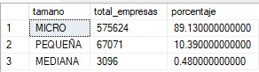
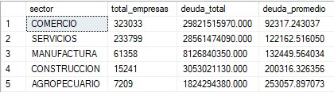
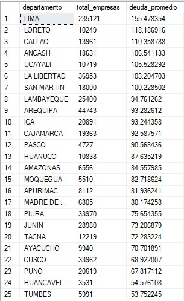
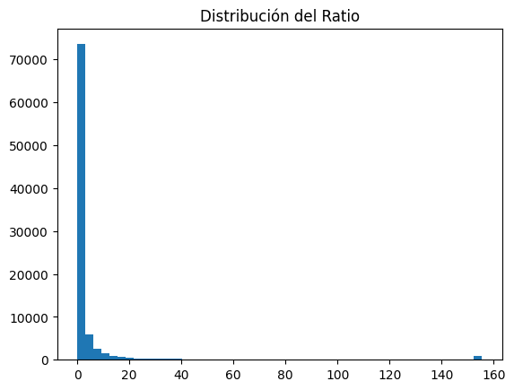
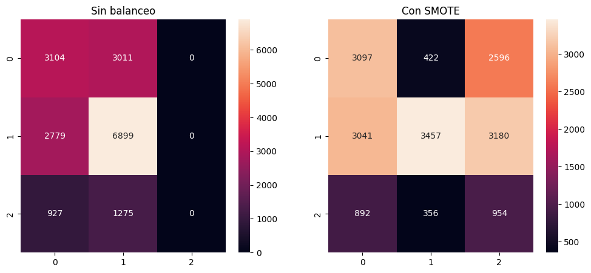

# 📊 Análisis de Riesgo Empresarial (SQL + Python + Machine Learning)

---

## 🧠 Descripción

Proyecto end-to-end donde se integran **SQL Server + Python + Machine Learning** para analizar y clasificar el riesgo financiero de empresas.

---

## 📁 Fuente de datos

🔗 https://www.datosabiertos.gob.pe/dataset/acceso-de-las-mipyme-al-cr%C3%A9dito-en-el-sistema-financiero-formal-ministerio-de-la-produccion

---

# 🗄️ SQL – Preparación y análisis de negocio

---

## 🔹 Limpieza y validación de datos

Se realizó un proceso completo de ETL:

* eliminación de registros inválidos
* tratamiento de valores nulos y negativos
* estandarización de variables

---

## 🔹 Análisis exploratorio en SQL

Se identificaron patrones clave a nivel agregado:

### 📊 Distribución por tamaño de empresa

---

### 📊 Análisis por sector

---

### 📊 Análisis geográfico

---

## 🎯 Construcción del target

Se definió un indicador de riesgo basado en el ratio deuda/ventas.

---

# 🐍 Python – Análisis y modelado

---

## 🔍 Análisis exploratorio

### 📊 Distribución del ratio

📌 Distribución altamente sesgada con presencia de outliers.

---

### 📊 Distribución del riesgo

📌 Dataset con desbalance moderado entre clases.

---

# 🤖 Modelado

---

## 🔴 Modelo sin balanceo

* Sesgo hacia clases mayoritarias
* No detecta correctamente la clase minoritaria

---

## 🟢 Modelo con SMOTE (balanceo real)

* Mejora la detección de "RIESGO MODERADO"
* Mayor equilibrio entre clases

---

### 📊 Evaluación

---

# 📈 Resultados clave

* El modelo sin balanceo ignora clases minoritarias
* SMOTE mejora significativamente el recall
* Mejor equilibrio en la clasificación

---

# 🎯 Conclusión

El proyecto demuestra la importancia del balanceo de clases en modelos de clasificación y el impacto de los outliers en variables financieras.

---

